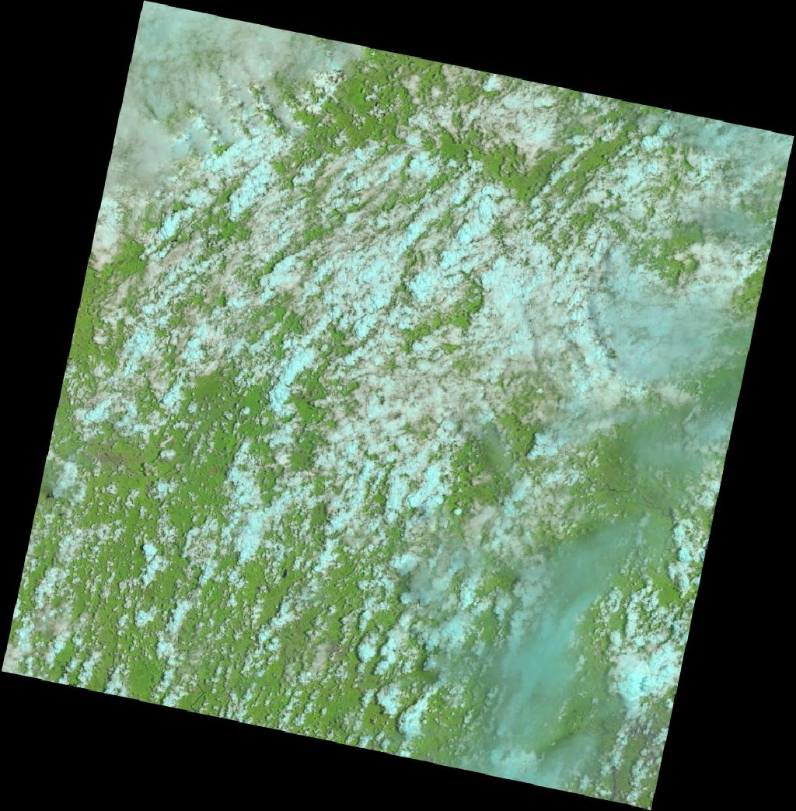

#  IMAGE 2 ANALYSIS — Upper Xingu Region (Vegetation & Terrain Patterns)

 

---

## ❓ PROMPT & GPT-4 RESPONSES
 

1.Are there any raised platforms, rectangular structures, ditches, or circular depressions that could indicate human-made earthworks?"  Why? LIDAR reveals hidden structures under trees. 
2."Can you point out any micro-relief (subtle bumps or depressions) that form a clear geometric pattern?"  Why? These are classic signs of pre-Columbian construction.
 3."Do you see any repeated spacing or alignments of features that might suggest a planned settlement or ceremonial site?"  Why? Many Amazonian cities were highly organized.

ANSWERS:
Q1: Are there any raised platforms, rectangular structures, ditches, or circular depressions that could indicate human-made earthworks?
 Observation:
•	In the lower-left forested zone, several light green “vein”-like lines cut diagonally across darker forest — they resemble narrow, regular gaps.
•	These could be historical ditches or land-clearings that were later reforested.
•	Some sharp edge shapes exist near the base of the triangular peninsula, which might align with ancient agro-fields or raised beds.
 Interpretation:
•	While not clearly elevated like LIDAR shows, the contrast in landform and vegetation distribution suggests past modification — possibly by humans.
•	Could be consistent with earthworks or ridge fields.
 Q2: Can you point out any micro-relief (subtle bumps or depressions) that form a clear geometric pattern?
 Observation:
•	The low cloud presence helps here — the bottom center of the image shows parallel light/dark horizontal strips in the green areas.
•	These suggest repeated terrain undulations, possibly long earthen ridges, though not clearly shaped into obvious circles or rectangles.
•	No sharp angular geometry is visible from this view, but these faint stripings should be cross-checked in LIDAR.
 Q3: Do you see any repeated spacing or alignments of features that might suggest a planned settlement or ceremonial site?
 Observation:
•	In the forest region to the far left, light green "bands" run vertically at regular spacing — like rows.
•	These may be remnants of road/trail systems or early agroforestry plots.
•	No clear urban grid or temple plaza layout is visible, but linear spacing is intriguing.

Summary:
 Weak-to-Moderate Signals of Ancient Activity:
•	Parallel bands in vegetation suggest possible ancient planning
•	Repetitive line spacing near lower left → worthy of further study
•	No definitive geometric mounds or plazas, but LIDAR can verify
 Limitation:
•	This is not a true LIDAR image — relief is inferred from vegetation and shading, so not fully reliable for micro-relief

